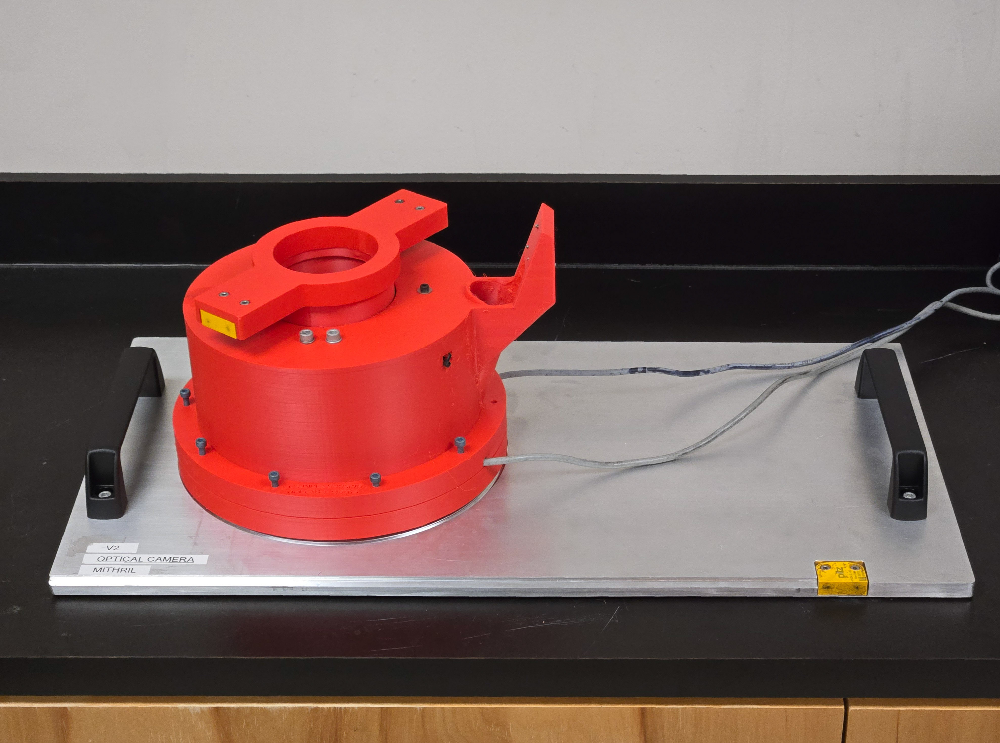
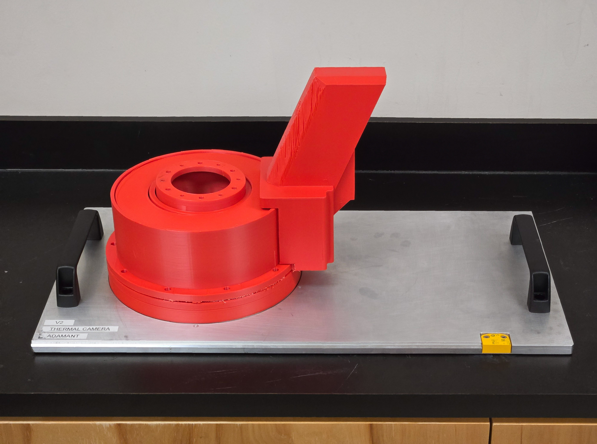
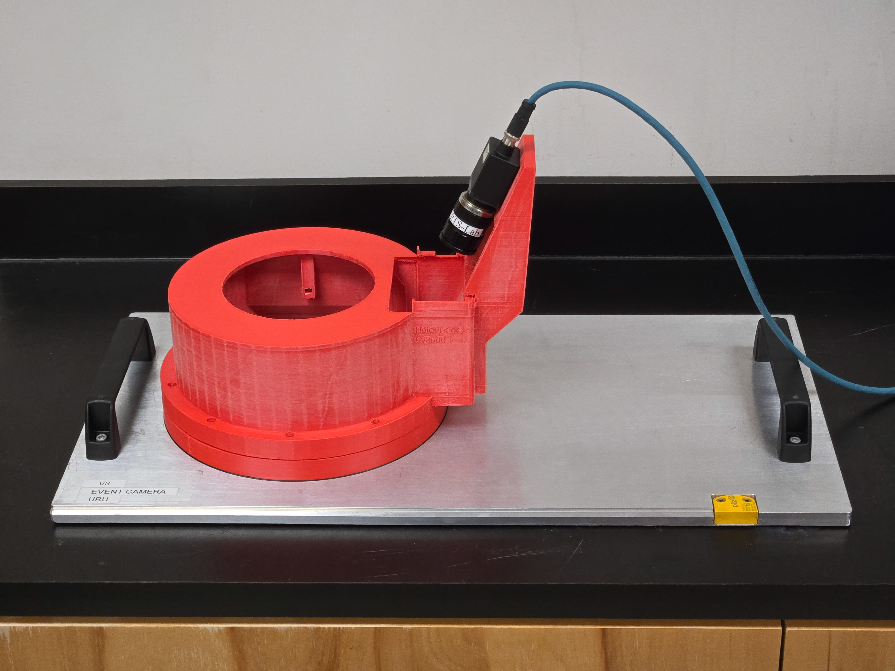
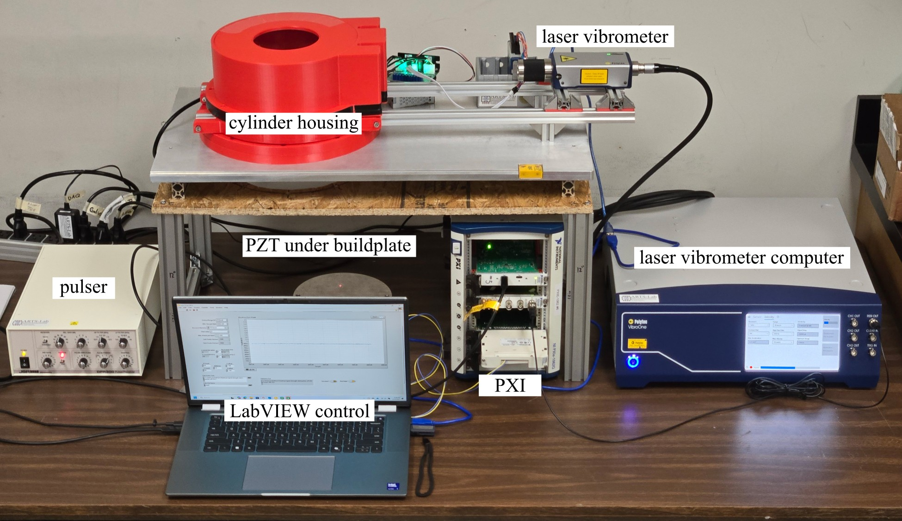
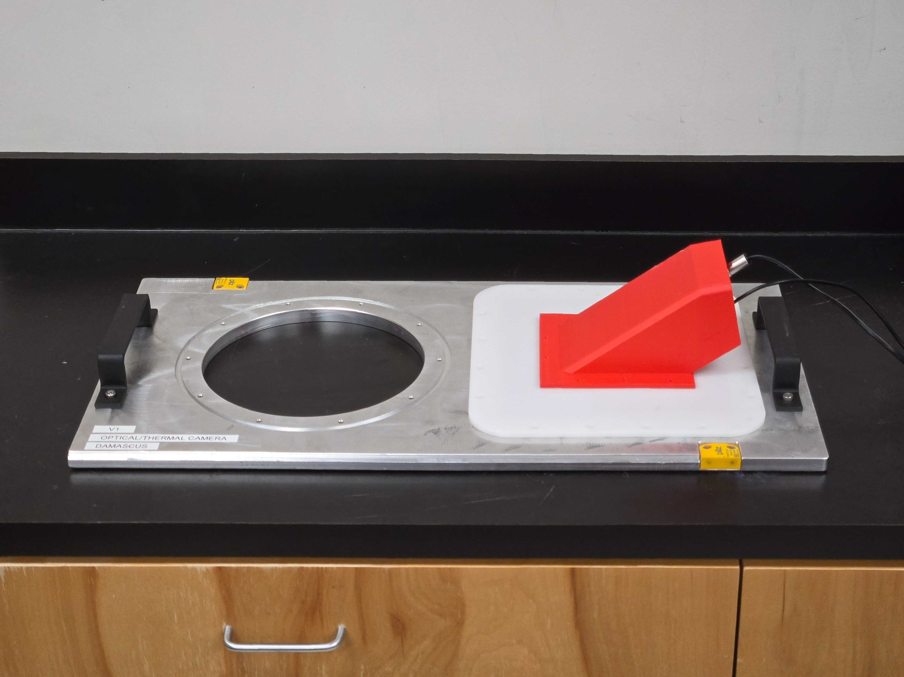
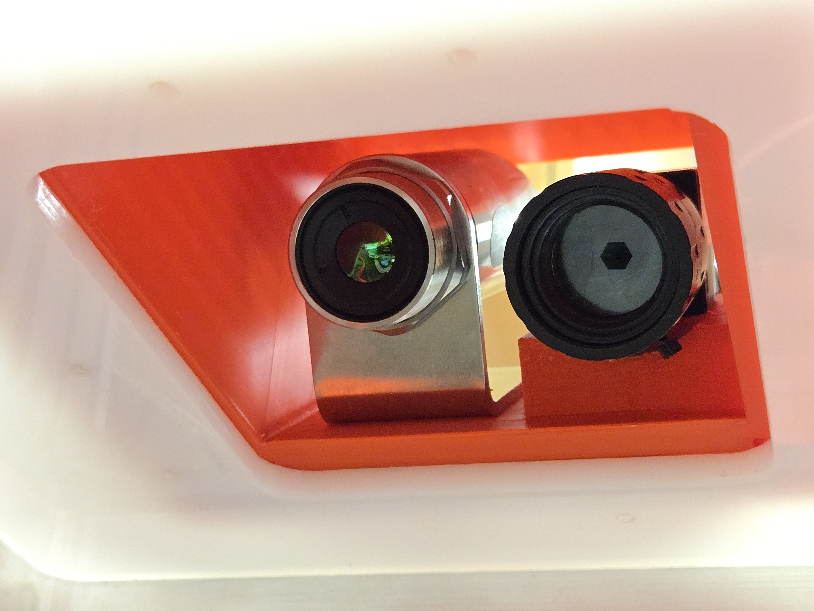

# Systems Variations  
Different system variations (i.e., product lines) are named after mythical materials. 

## [Mithril](Mithril)
* A legendary, lightweight, and strong metal from Tolkien’s Middle-earth.
* Sensing system designed with an optical camera.

   
Custom cover with an integrated optical camera mount for laser-based powder bed fusion additive manufacturing monitoring. Camera not yet installed.

## [Adamant](Adamant)
* An ancient term for an unbreakable, diamond-like substance.
* Sensing system designed with a THERMAL CAMERA.

   
Custom cover with an integrated thermal camera mount for laser-based powder bed fusion additive manufacturing monitoring. 

## [Uru](Uru)
* A mystical Asgardian metal, known for its magical properties.
* Sensing system designed with an EVENT CAMERA.

   
Custom cover with event camera mount for in-situ monitoring of laser-based powder bed fusion processes.

## [Orichalcum](Orichalcum)
* A lost golden-red metal from Atlantis and Greek mythology.
* Sensing system designed with a LASER VIBROMETER.

   
Experimental setup including custom cover assembly, laser vibrometer, piezoelectric transducer, and pulser. 

## [Damascus](Damascus)
* A famed patterned steel, known for strength and sharpness.
* Sensing system designed with multiple sensing systems.

   
   
Integrated dual vision holder securely mounts a thermal camera and an optical camera for synchronized data acquisition on a custom cover. 

## [Oblivium](Oblivium)
* A mythical dark metal associated with secrecy, resilience, and hidden power.
* Sensing system designed with EDGE COMPUTING CAPABILITIES for in-situ data processing.
  
   
   
Integrated edge computing hardware with an optical camera setup for synchronized data acquisition and processing on a custom cover. 

